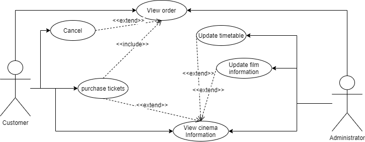
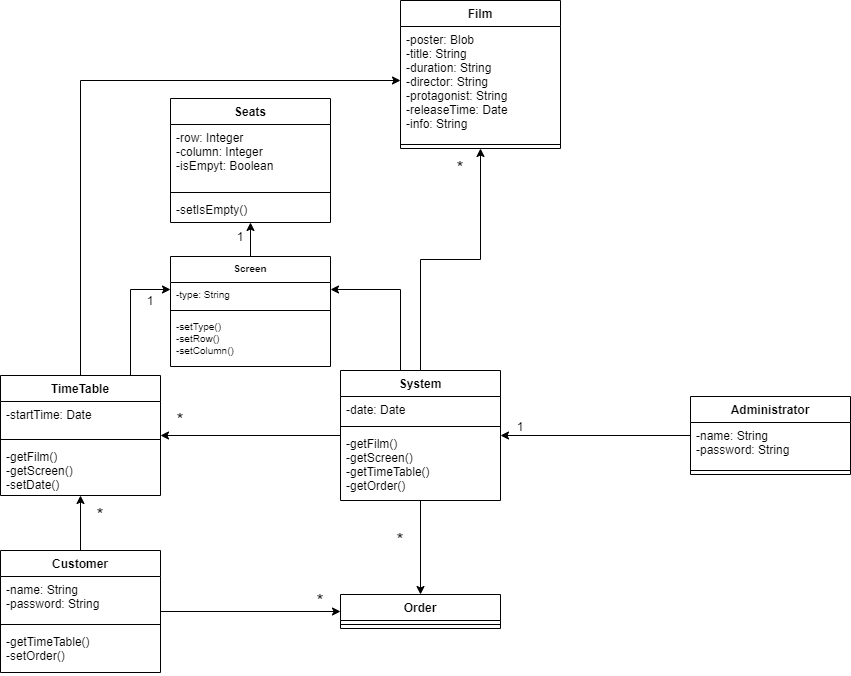

# Project Description

This project will involve the design and implementation of a software system for the management of a cinema.
This will be a single user desktop application with a graphical user interface.
There are two parts to the software, an administrative panel that allows scheduling the movies that will be
shown and which screens they will be shown on and ticket panel that can be used by the staff to sell tickets to
the customers of the cinema. You can implement these as a single application or as two separate applications
that connect to the same database.

## Use Case diagram

## Use Case descriptions

Use Case descriptions are in the requirements analysis folder.

##  Domain model

## System Glossary

#### Movie details: 

Movies details includes film posters, film titles, film duration, film directors, protagonists, movies release time and brief introduction. Customers can learn more about the movie via Movie details. Administrator can change or update movie details to make sure customer know movies better.

#### Reservation information: 

For customer, reservation information is: when they check ticket information, they can see films’ schedule, current shows’ sales quantity and ticket prices. When they decide to purchase tickets, they will select movies date and select wanted seats. For administrator, reservation information is: screen information modification (change screen from normal to IMAX, etc.), films schedule and modification, ticket fares arrangement and modification.

#### Ticket processing: 

After payment, customers can view their orders. If customers need, they can submit refund requests or ticket changing requests. Administrator can check all orders and they are responsible to deal with these requests. If cinema have some situation so that films, screen, schedule or seats need to change, administer will initiative refund.

 
